<div align="center">
  
</div>

<div align="center">
  
</div>

<div align="center">

  <a href="https://davytheprogrammer.github.io/davytheprogrammer/">
    
  </a>

</div>

<div align="center">
  
</div>

<br/>

<div align="center">
  <a href="https://linkedin.com/in/davismachinogega">
    
  </a>
  <a href="https://twitter.com/officialogega">
    
  </a>
  <a href="https://ogegadavis.dev">
    
  </a>
</div>

---

## ⚡ Core Arsenal

<div align="center">
  
</div>

---

## ⚡ Technology DNA

<div align="center">

### **Primary Stack**


### **Infrastructure & AI**


</div>

---

## 📊 GitHub Pulse

<div align="center">

### **Contribution Flow**


<br/><br/>

### **The Snake That Eats My Commits**

<picture>
  <source media="(prefers-color-scheme: dark)" srcset="https://raw.githubusercontent.com/davytheprogrammer/davytheprogrammer/output/snake-dark.svg" />
  <source media="(prefers-color-scheme: light)" srcset="https://raw.githubusercontent.com/davytheprogrammer/davytheprogrammer/output/snake.svg" />
  
</picture>

<br/><br/>

### **Live Stats — self-hosted, no third-party downtime**


</div>

---

## 💻 Code Signature

```typescript
// davytheprogrammer.ts

class CodeArchitect {
  constructor(
    public alias: string = "davytheprogrammer",
    public version: string = "2026.07",
    public mode: string = "production"
  ) {}

  build(productIdea: string): Solution {
    const architecture = this.designNextJSArchitecture(productIdea);
    const ui = this.vibeCodeInterface(architecture);
    const api = this.generateEdgeAPIs(architecture);
    const scene = this.renderThreeJSExperience(architecture);
    const deployed = this.deployToVercel(ui, api, scene);

    return {
      deployed,
      performance: "blazing",
      vibes: "immaculate",
      timestamp: Date.now()
    };
  }

  private renderThreeJSExperience(architecture: any): WebGLScene {
    return new WebGLScene({ bloom: true, dimension: 3, realityLevel: "next-gen" });
  }
}

const davis = new CodeArchitect();
const nextProject = davis.build("Revolutionary AI-Powered App");
console.log(`🚀 ${nextProject.vibes.toUpperCase()} - ${nextProject.performance}`);
```

---

## ⚡ Active Deployment Status

<div align="center">

| | |
|-|-|
| **Current Focus** | Next.js 15 + React 19 |
| **Architecture** | App Router + RSC |
| **Speed** | ⚡ Ludicrous Mode |
| **AI Augmentation** | Claude Code |
| **Deploy Target** | Vercel Edge |
| **3D Command Center** | 🟢 ONLINE — [launch it →](https://davytheprogrammer.github.io/davytheprogrammer/) |
| **Status** | **🔥 SHIPPING CODE** |

</div>

---

## 🔮 Development Trajectory

<div align="center">

```
Now ───────────────────────────────────── Future
  ↓                                         ↓
Building AI Agents         →  Autonomous Systems
Next.js Ecosystem         →  Edge Computing
Full-Stack Apps           →  Distributed Apps
ML/DL Models             →  Custom LLMs
Mobile Development       →  AR/VR Experiences
2D Interfaces             →  Real-Time 3D/WebGL
```

</div>

---

## 📬 Signal Contact

<div align="center">

<a href="https://linkedin.com/in/davismachinogega">
  
</a>
<a href="https://twitter.com/officialogega">
  
</a>
<a href="https://ogegadavis.dev">
  
</a>
<a href="https://davytheprogrammer.github.io/davytheprogrammer/">
  
</a>

<br/><br/>


</div>
