

  

  

 

  <a href="https://davytheprogrammer.github.io/davytheprogrammer/">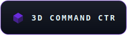</a>

  

 

  
  
  
  

 


 

  

 


 

  

 


 

  

<picture>
  <source media="(prefers-color-scheme: dark)" srcset="https://raw.githubusercontent.com/davytheprogrammer/davytheprogrammer/output/snake-dark.svg" />
  <source media="(prefers-color-scheme: light)" srcset="https://raw.githubusercontent.com/davytheprogrammer/davytheprogrammer/output/snake.svg" />
  
</picture>

  

 


 

  

 


 

  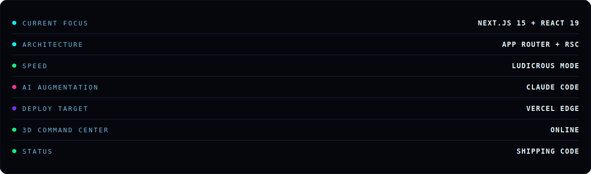

 


 

  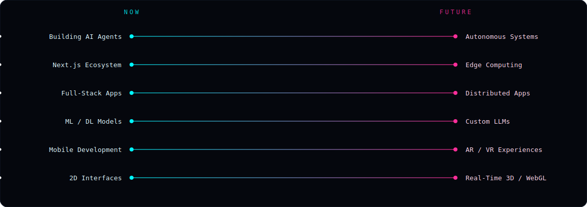

 


 

  

