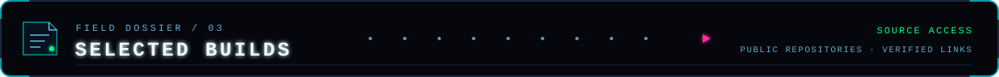
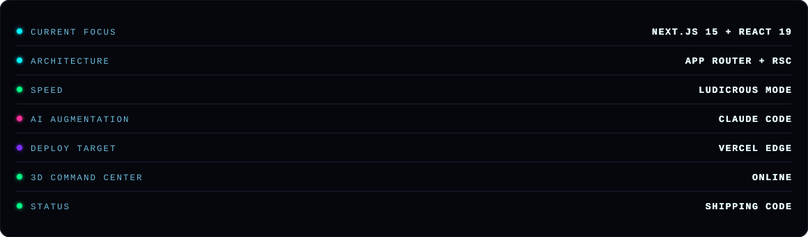
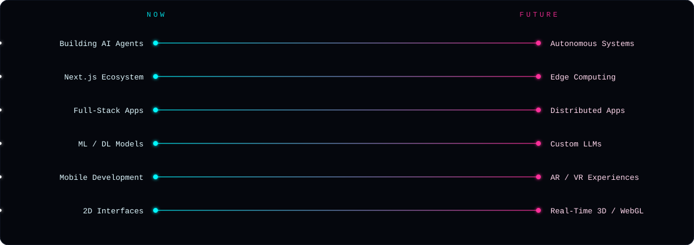

  

  

  

 

  
  
  
  

 



 

  

 



 

  

 

  

<table>
  <tbody>
    <tr>
      <td width="33%" valign="top">
        
<strong><code>01 / CYBERAUDIT</code></strong> SECURITY LAB · FASTAPI + TAURI

        
Educational vulnerability scanner with a visual exploit-chain simulator.

        <a href="https://github.com/davytheprogrammer/web-vulnerability-scanner">↗ INSPECT SOURCE</a>
      </td>
      <td width="33%" valign="top">
        
<strong><code>02 / HOTSPOT MANAGER</code></strong> LINUX SYSTEMS · GTK + CLI

        
Linux hotspot control with a desktop interface, system tray, and hardware detection.

        <a href="https://github.com/davytheprogrammer/hotspot-manager">↗ INSPECT SOURCE</a>
      </td>
      <td width="33%" valign="top">
        
<strong><code>03 / FLUTTER STARTER</code></strong> CROSS-PLATFORM · MATERIAL 3

        
A reusable Flutter foundation for building polished apps across platforms.

        <a href="https://github.com/davytheprogrammer/flutter-modern-template">↗ INSPECT SOURCE</a>
      </td>
    </tr>
  </tbody>
</table>

  

 



 

  

<picture>
  <source media="(prefers-color-scheme: dark)" srcset="https://raw.githubusercontent.com/davytheprogrammer/davytheprogrammer/output/snake-dark.svg" />
  <source media="(prefers-color-scheme: light)" srcset="https://raw.githubusercontent.com/davytheprogrammer/davytheprogrammer/output/snake.svg" />
  
</picture>

  

 



 

  

 



 

  

 



 

  

 



 

  

